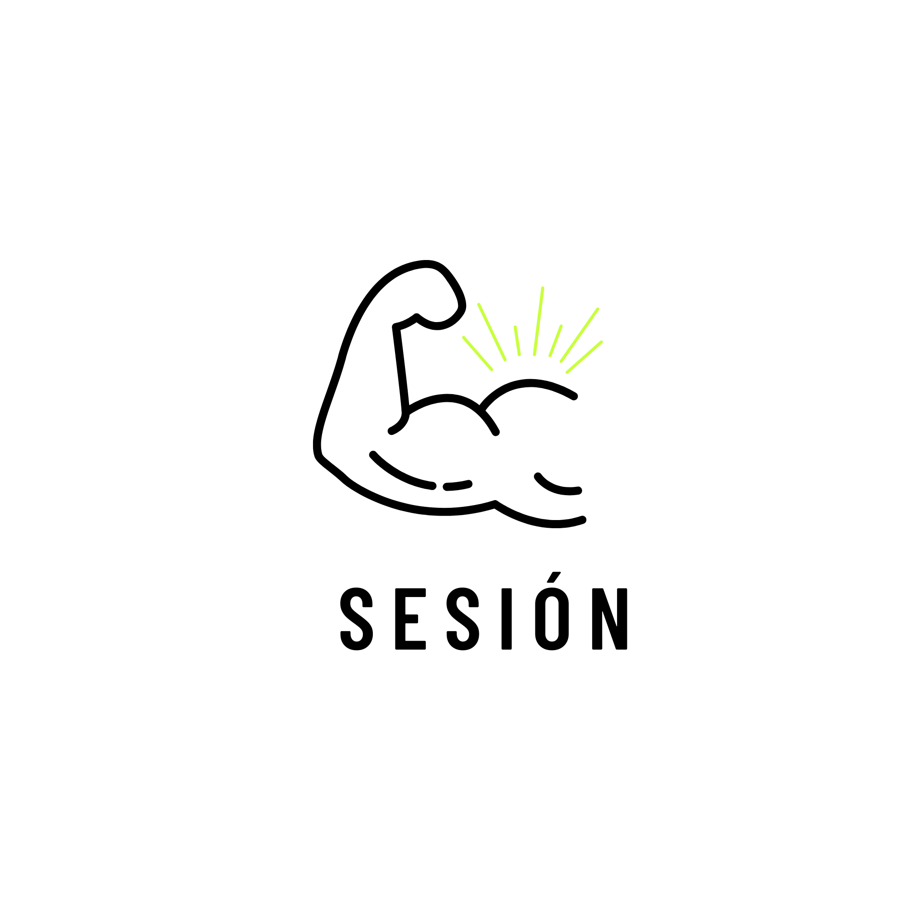

<p align="center">
  
</p>

<h1 align="center">Sesión</h1>

<p align="center">
  Book fitness &amp; wellness sessions and pay coaches directly in <strong>NIM</strong> —
  instant, no card, no borders, non-custodial. A <a href="https://www.nimiq.com/nimiq-pay/">Nimiq Pay</a> Mini App.
</p>

## Open the app

Scan this QR with your phone to open Sesión inside **Nimiq Pay**:

<p align="center">
  
</p>

Or use the deeplink: `nimiqpay://miniapp?url=https://sesion-alpha.vercel.app/`

> `public/logo.png` is the official Sesión logo and is used as the **app icon** (favicon, home-screen icon and Nimiq Pay mini-app icon).

## What it does

Sesión is a two-sided marketplace for fitness &amp; wellness classes (yoga, boxing, dance, pilates, strength, wellness).

**Clients**
1. **Browse** local sessions from independent coaches.
2. **Book** a spot and **pay the coach directly in NIM** — one tap, settled in seconds.
3. **Get a QR ticket** to show (or save) at the door.

**Coaches** get their own space to:
- **Create sessions** (with cover photo and place autocomplete),
- **Manage events** and **scan attendees' QR** to check them in,
- Set a **contact** shown on their offers, and get **paid straight to their wallet**.

Payments go **straight from client to coach** — Sesión never holds funds, takes no card, and asks for no KYC. A coach anywhere in the world can get paid instantly, even where cards and Stripe don't work.

## Tech stack

- React + Vite + Tailwind CSS
- [`@nimiq/mini-app-sdk`](https://www.npmjs.com/package/@nimiq/mini-app-sdk) for wallet access and payments
- FastAPI + SQLite backend (sessions, tickets, profiles, check-in, uploads)
- Deployed on Vercel

## Getting started

```bash
npm install
npm run dev
```

The app runs in a normal browser and inside Nimiq Pay (where real payments happen).

## Project structure

```
public/         Logo + app QR
src/
  components/   Reusable UI (SessionCard, CategoryChips, BottomNav, CoachNav, QrScanner, LocationInput)
  data/         Categories and static reference data
  lib/          Nimiq SDK wrapper, store, profiles, uploads, helpers
  pages/        Client screens + coach space (CoachLayout, CoachEvents, Create, CoachEventDetail, CoachProfile)
```
