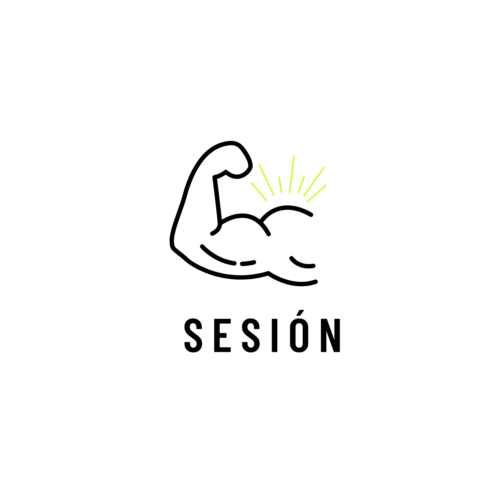

<p align="center">
  
</p>

<h1 align="center">Sesión</h1>

<p align="center">
  Join local fitness sessions near you — see who's coming, and reserve your spot in <strong>NIM</strong>.
  Instant, no card, no borders. A <a href="https://www.nimiq.com/nimiq-pay/">Nimiq Pay</a> Mini App.
</p>

## Open the app

Scan this QR with your phone to open Sesión inside **Nimiq Pay**:

<p align="center">
  
</p>

Or use the deeplink: `nimiqpay://miniapp?url=https://sesion-alpha.vercel.app/`

> `public/logo.png` is the official Sesión logo and is used as the **app icon** (favicon, home-screen icon and Nimiq Pay mini-app icon).

## What it does

Sesión is the chill way to **start or join local fitness sessions** — a sunrise run, a boxing class, yoga in the park, a pickup game. Anyone can host, anyone can join. Two sides:

**People who join**
1. **Browse** local sessions and see **who's coming**.
2. **Reserve your spot** by paying the host in **NIM** — one tap, settled in seconds.
3. **Get a QR ticket** to show (or save) at the door.

**Hosts**
- **Create a session** (with a cover photo and place autocomplete),
- get **paid straight to their wallet**, and **scan attendees' QR** to check them in.

The small NIM payment = **reserving your spot**: it keeps people committed (fewer no-shows) and, if the host brings gear or books a court, supports them. Payments go **straight from joiner to host** — Sesión never holds funds, takes no card, and asks for no KYC. So anyone, anywhere, can join in seconds.

**Trust:** hosts build a reputation from real ratings (only people who booked can rate), no-show reports flag flaky hosts, and new hosts are clearly labelled — no fake reviews.

## Tech stack

- React + Vite + Tailwind CSS
- [`@nimiq/mini-app-sdk`](https://www.npmjs.com/package/@nimiq/mini-app-sdk) for wallet access and payments
- FastAPI + SQLite backend (sessions, tickets, profiles, ratings, check-in, uploads)
- Deployed on Vercel

## Getting started

```bash
npm install
npm run dev
```

The app runs in a normal browser and inside Nimiq Pay (where real payments happen).

## Project structure

```
public/         Logo + app QR
src/
  components/   Reusable UI (SessionCard, CategoryChips, BottomNav, CoachNav, QrScanner, LocationInput)
  data/         Categories and static reference data
  lib/          Nimiq SDK wrapper, store, profiles, ratings, uploads, helpers
  pages/        Join-side screens + host space (CoachLayout, CoachEvents, Create, CoachEventDetail, CoachProfile)
```
